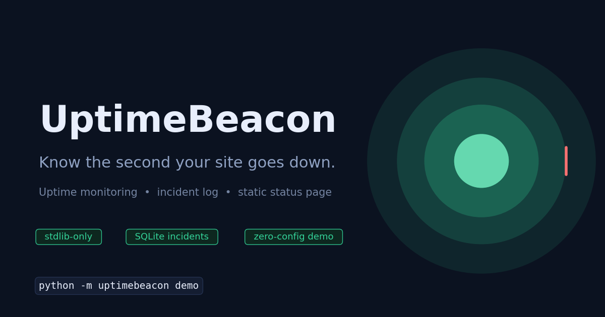
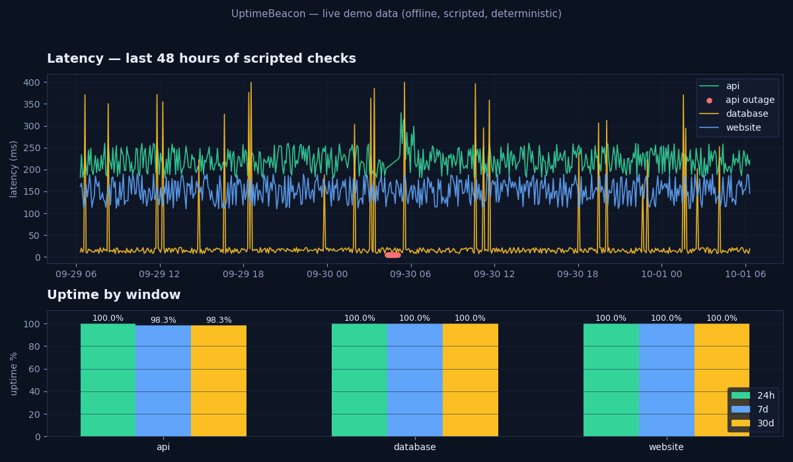

# UptimeBeacon

**Know the second your site goes down.** UptimeBeacon is a zero-dependency uptime monitor: it checks your services on a schedule, logs every outage to SQLite with automatic incident open/close, and renders a beautiful, fully self-contained static status page you can host anywhere — no backend, no database server, no external requests.




## See it in action

One command replays 48 hours of scripted checks (including a real 45-minute API outage) into SQLite and renders the status page — **fully offline, about a second**:

```bash
python3 -m uptimebeacon demo --dir demo-out
# then open demo-out/status.html in your browser
```

Dashboard rendered from that exact demo data — real check rows, real stats:



And the incident log from the same run:

```text
$ python3 -m uptimebeacon --config demo-out/demo-config.yaml \
      --db demo-out/demo.db incidents
[resolved] api               2026-09-30 04:12 -> 2026-09-30 04:57
           cause: unexpected status 503
```

## Features

- **Scheduled checks, stdlib only** — `urllib`-based HTTP(S) checks with per-target interval, timeout, expected status codes, and response-keyword matching. Zero runtime dependencies.
- **`check` once, `watch` forever** — run a single check round on demand, or run the daemon-style loop that checks each target on its own cadence until Ctrl-C.
- **Automatic incident log** — SQLite-backed. A failed check opens an incident; the first passing check closes it. Every incident gets start, end, duration, and cause with no manual bookkeeping.
- **Latency & uptime analytics** — rolling average/p95/min/max latency and uptime % over 24h / 7d / 30d windows, computed from stored history.
- **Static status page generator** — one self-contained HTML file (inline CSS, inline SVG sparklines, zero external assets): overall status banner, per-service cards with uptime and latency, recent incident timeline. Drop it on GitHub Pages, S3, or nginx.
- **Offline demo mode** — deterministic scripted scenario (seeded RNG) so the whole pipeline — checks → incidents → status page — runs end-to-end with no network.
- **Simple YAML config** — human-readable targets file; no PyYAML required (a tiny built-in parser covers the config subset, documented below).

## Tech stack

| Layer | Choice |
|---|---|
| Language | Python 3.10+ |
| HTTP checks | `urllib` (stdlib) |
| Storage | SQLite via `sqlite3` (stdlib) |
| CLI | `argparse` (stdlib) |
| Status page | Single-file HTML, inline CSS + inline SVG sparklines |
| Charts (docs) | matplotlib (docs tooling only, not a runtime dep) |
| Tests | pytest (dev only) |

Runtime dependencies: **none**. `pip install` nothing; `python3 -m uptimebeacon demo` just works.

## Quickstart

```bash
# 0. Clone and enter the project
git clone https://github.com/872000/uptimebeacon.git
cd uptimebeacon

# 1. Run the offline demo end-to-end (~1s, no network, no API keys)
python3 -m uptimebeacon demo --dir demo-out
open demo-out/status.html          # macOS; or xdg-open on Linux

# 2. Monitor your own services
python3 -m uptimebeacon add --name api \
    --url https://api.example.com/health \
    --interval 60 --expected-status 200 --keyword '"ok"'
python3 -m uptimebeacon add --name website \
    --url https://example.com --interval 300

# 3. Check once, or watch on a loop
python3 -m uptimebeacon check
python3 -m uptimebeacon watch                  # Ctrl-C to stop
python3 -m uptimebeacon serve-loop --iterations 5   # bounded run

# 4. Review incidents and publish the status page
python3 -m uptimebeacon incidents
python3 -m uptimebeacon status-page --out status.html

# 5. Run the test suite (only dev dependency: pytest)
pip install -r requirements-dev.txt
python -m pytest
```

## Configuration

`uptimebeacon.yaml` (created by `add`, or write it by hand):

```yaml
database: uptimebeacon.db
targets:
  - name: api
    url: https://api.example.com/health
    interval: 60            # seconds between checks
    timeout: 10             # per-check timeout
    expected_status: [200, 204]
    keyword: '"ok"'         # optional: must appear in the response body
  - name: website
    url: https://example.com
    interval: 300
    timeout: 10
    expected_status: [200]
```

The built-in YAML parser supports mappings, lists of mappings, inline lists, quoted strings, numbers, and booleans — everything above, nothing you don't need. Override paths per-command with `--config` and `--db`.

## Project structure

```text
uptimebeacon/
├── uptimebeacon/
│   ├── __init__.py      # version
│   ├── __main__.py      # python -m uptimebeacon entry point
│   ├── cli.py           # add / check / watch / status-page / incidents / demo
│   ├── config.py        # YAML-subset parser + validation (no PyYAML needed)
│   ├── checker.py       # urllib-based HTTP checks (never raises)
│   ├── store.py         # SQLite: check history + auto open/close incident log
│   ├── stats.py         # latency avg/p95, uptime % windows, sparkline series
│   ├── statuspage.py    # self-contained HTML status page generator
│   └── demo.py          # offline scripted scenario (seeded, deterministic)
├── tests/               # 33 pytest tests, all offline
├── scripts/
│   └── render_images.py # regenerates docs/hero.png + docs/demo-status.png
├── docs/
│   ├── hero.png
│   └── demo-status.png
├── demo/                # sample config for real monitoring
│   └── targets.yaml
├── pyproject.toml
├── requirements-dev.txt # pytest only
└── LICENSE (MIT)
```

## How it works

1. `watch` (or `check`) performs `urllib` requests per target on its interval and appends one row per check to SQLite — timestamp, pass/fail, latency, status code, error.
2. `store.log_check` maintains the incident log transactionally: first failure opens an incident, first success closes it.
3. `status-page` aggregates the history — uptime % per 24h/7d/30d window, latency avg/p95, downsampled sparkline series — and renders a single HTML file with everything inlined.

## Roadmap

- [ ] Alerting: webhooks (Slack/Discord), email via SMTP, and PagerDuty events on incident open/close
- [ ] TLS certificate expiry checks alongside HTTP checks
- [ ] Multi-region checks ("is it down for everyone or just me?")
- [ ] JSON API export of uptime/incident data for external dashboards
- [ ] Retention policies + automatic SQLite vacuuming for long-running monitors
- [ ] `uptimebeacon serve`: tiny built-in HTTP server for the status page + live refresh

## License

MIT © 2026 Parth (872000). See [LICENSE](LICENSE).
